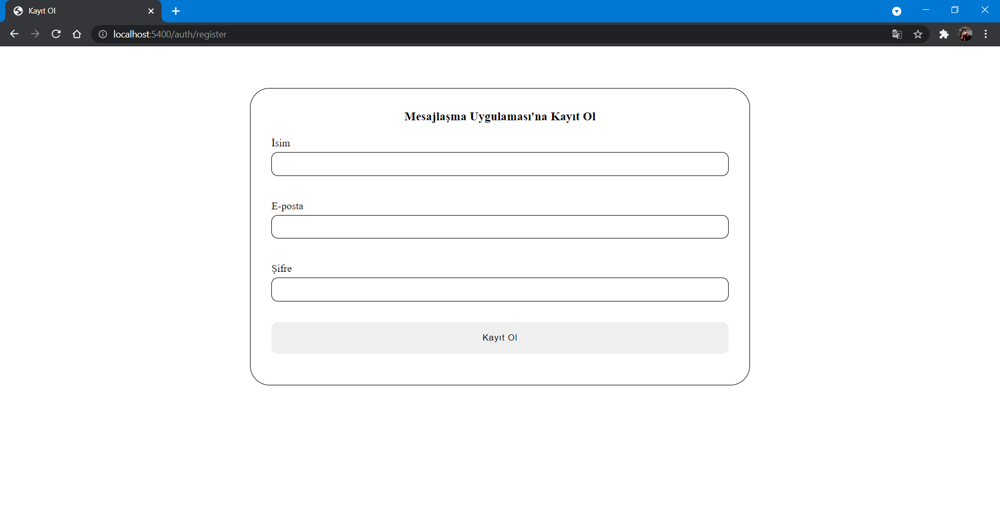
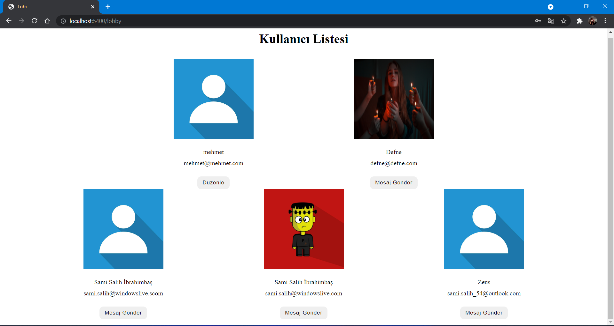
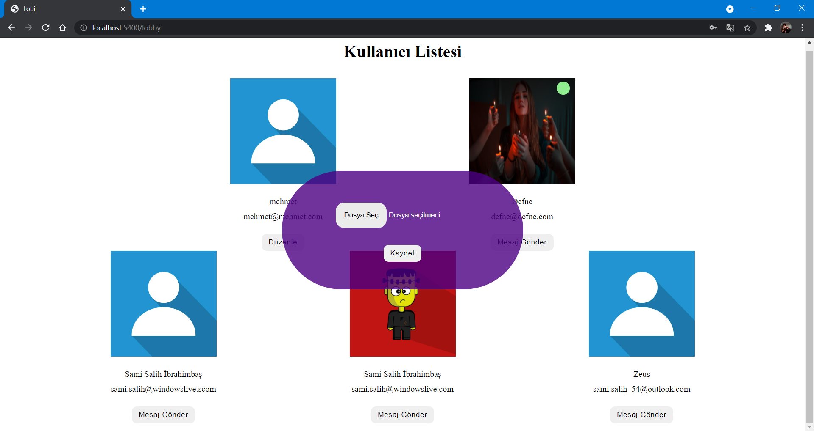

## Samchat v0.0.1

Bu makale hem Türkçe hem de İngilizce açıklamalar içermektedir. This article contains both Turkish and English descriptions.

<br>

<hr>

<br>

### Türkçe Açıklamalar | Turkish Descriptions

#### Projeyi Başlatma:
Dosyayı indirdikten sonra terminale gelip,

```
npm install
```

komutunu giriniz. Ardından config/env altında bir config.env dosyası oluşturun ve gerekli entegrasyonları gerçekleştirin.

Ardından terminale,

```
npm run dev
```

ya da

```
npm run start
```

komutunu girin. Artık proje çalışıyor. Tebrikler.

#### Kullanılan Teknolojiler:
> + Expressjs
> + socketio
> + jsonwebtoken
> + Diğerleri:
>> + bcryptjs
>> + dotenv
>> + mongoose
>> + multer

<br>

<hr>

<br>

### İngilizce Açıklamalar | English Descriptions

#### Starting Project:
After downloading the file, go to the terminal,

```
npm install
```

Enter the command. Then create a config.env file under config/env and perform the necessary integrations.

Then to the terminal,

```
npm run dev
```

or

```
npm run start
```

Enter the command. Now the project is running. Congratulations.

#### Used technologies:
> + Expressjs
> + socket
> + jsonwebtoken
> + Others:
>> + bcryptjs
>> + dotenv
>> + mongoose
>> + multer

<hr>

### Ekran Görüntüleri | Screenshots :

##### 1- Giriş Yapma Sayfası / Log In Page


##### 2- Kayıt Olma Sayfası / Register Page


##### 3- Giriş Kontrolü / Log In Controller


##### 4- Lobi Sayfası / Lobby Page


##### 5- Lobi'de Çevrimiçi Durumu / Online Status in Lobby


> Yeşil nokta, green dot

##### 6- Fotoğraf Değiştirme / Photo Change


##### 7- Chat Sayfası / Chat Page


##### 8- Yazıyor Durumu / Typing Status


##### 9- Bildirim (sadece lobi sayfasında) / Alert (only loby page)


##### 10- Görüldü / Seen
